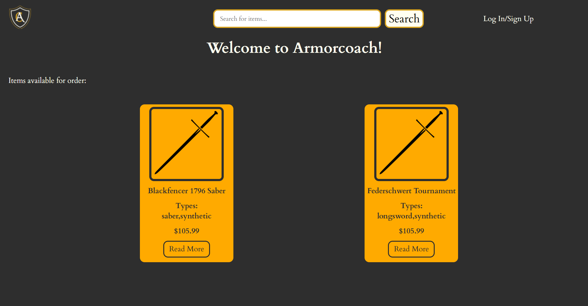
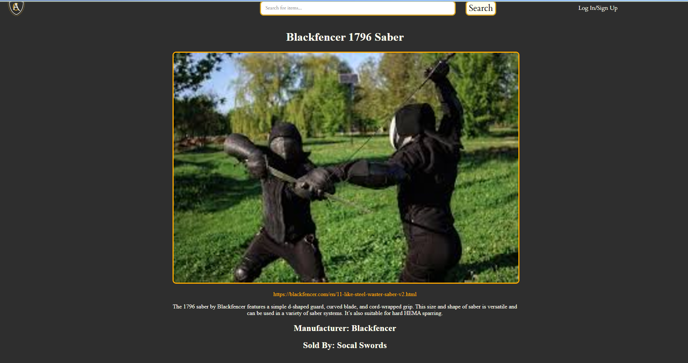
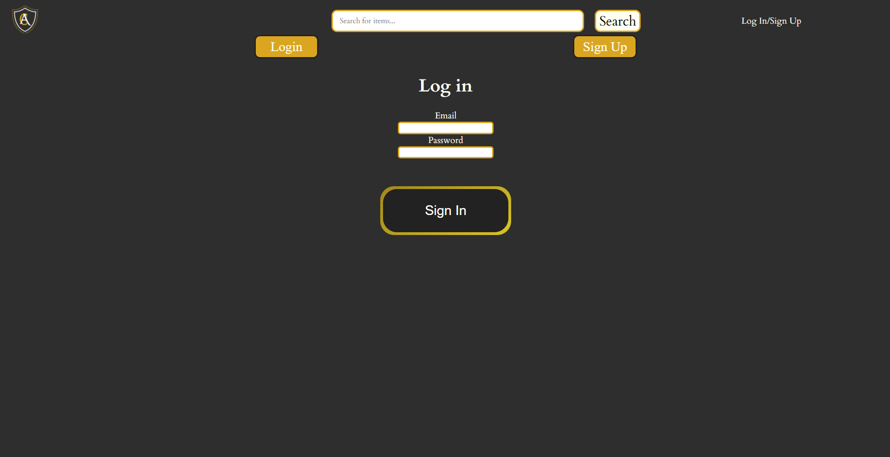
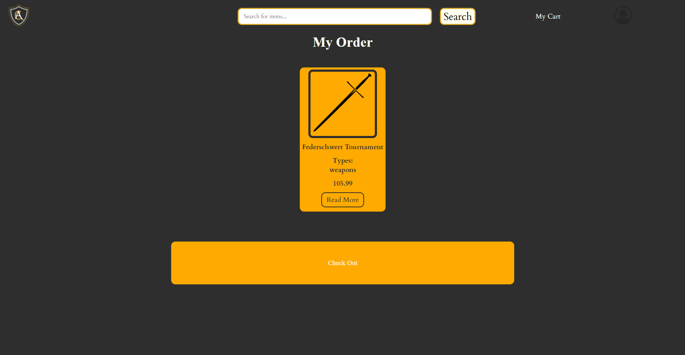
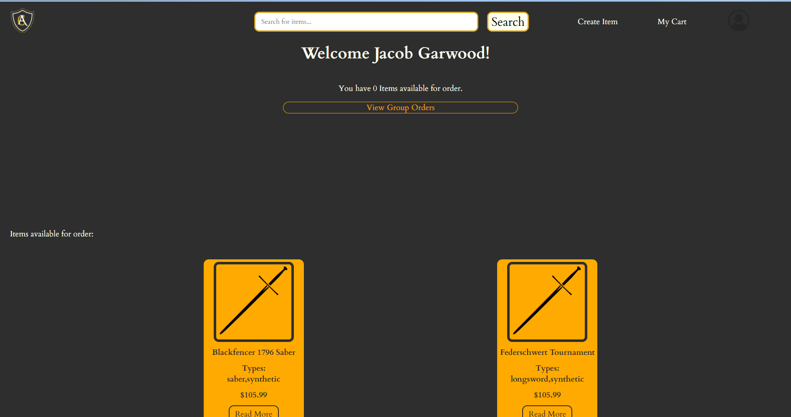
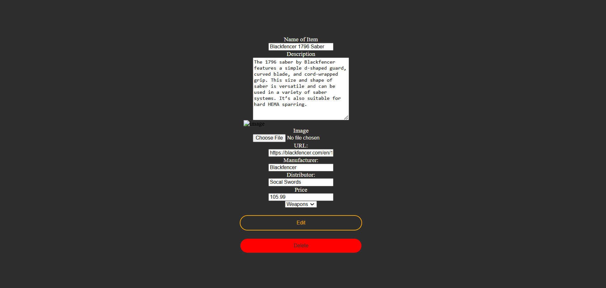
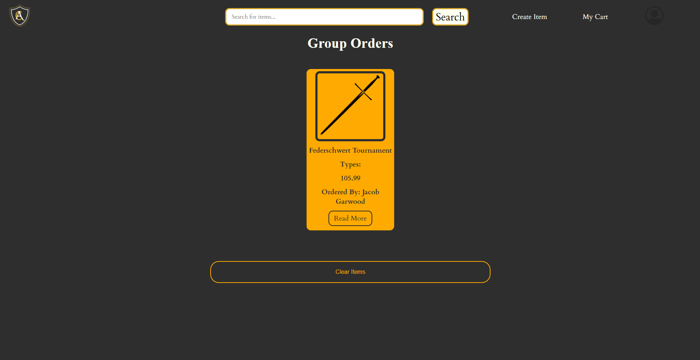

## Armorcoach

### Project URL: https://n-423-homework.vercel.app/
### A project created for N-423
Armorcoach is an application designed for Historical European Martial Arts (HEMA) Schools that have the ability to place large group orders. The app is structured for both students and instructors, and allow students to place orders into a main "group order" category, which the instructor can then order on their respective websites.

The website is structured in a few different ways, depending on what role you have. 

#### Not Signed In
If a user is not signed in, there are only 3 pages available to them- The home page: 

The details page for a product:

*Note that when not signed in, the user has no way to place an order.*
And the Sign In/Sign Up Page:

Which will allow the user to then sign into the application.

#### Signed In
If a user is signed in, there is more functionality to what they can do. It'll still have the same functions as the non signed in, but with 2 differences:
* Viewing an item will allow them to add it to their cart.
* There is a new "My Cart" page that allows them to place the order:

#### Signed in with Admin
This has the most functionality, allowing administrators to edit the database directly.

The home page contains more data, most notably the "View Group Orders" Screen, and the "Create Item" Screen: 

In the "Create Item" Screen, you are able to add new data and upload images to use to display images: 

*Note: If you make a mistake during the creation, don't worry! You can edit it! Just head to the item details and click on the button that says to edit the entry:*

*You can also delete the item if you want to!*

The group orders page has all the orders placed by users, complete with data showing who placed the order:

Once you are completed ordering the items on their respective sites, you can then delete all the items in the cart.
